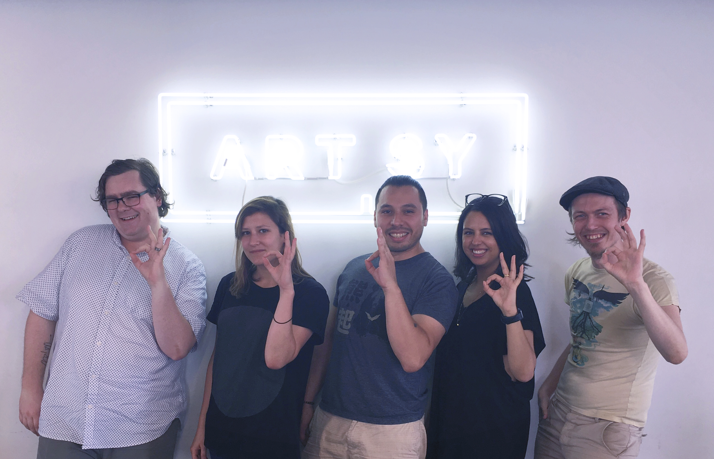

### [Artsy Mobile team issue tracker.](https://github.com/artsy/mobile/issues)

Artsy Mobile is [@alloy](https://github.com/alloy), [@ashfurrow](https://github.com/ashfurrow), [@katarinabatina](https://github.com/katarinabatina), [@mennenia](https://github.com/mennenia),  [@orta](https://github.com/orta), and [@sarahscott](https://github.com/sarahscott).  If you're interested in joining, [look here](https://artsy.net/job/mobile-engineer).

We revolve around three apps. [Eigen](http://iphone.artsy.net) is the iOS app for the general public,  [Energy](http://orta.io/#folio-header-unit) a portfolio app for gallery partners and [Eidolon](https://github.com/artsy/eidolon/) an open-source Auctions bidding app. All our project names are based on physics terms beginning with e. You can read our manifesto [here](http://www.objc.io/issue-22/artsy.html
).

Our general team playbook is [available here](playbook.md) - this is a document covering on-boarding, setup and an overview of our tech stack. It is meant to be read with the private [artsy/potential](https://github.com/artsy/potential).

This repo is for keeping track of issues around the team, and telling people to do stuff etc. Open because [Open by Default](http://code.dblock.org/open-source-is-simply-part-of-my-teams-job-description). Feel free to post issues about and around the artsy mobile team here. It goes straight to our slack room, so ideally, include a GIF.

<h3 align="center">
  
</h3>
